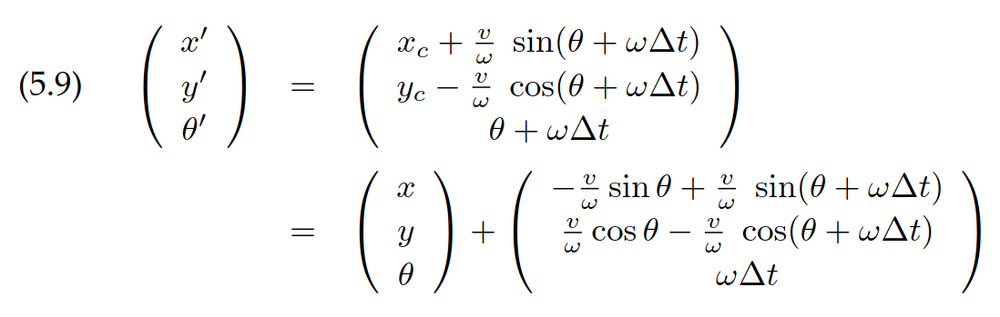

# Assignment-2

Assignment 2 for CSCI 1952D (Spring 2026).

## Setup & Installation

This assignment uses the same Conda environment as Assignment 1.
To enter the Conda environment, build, and source the workspace, use the commands:

```bash
conda activate ros2_env
colcon build --symlink-install
source install/setup.zsh    # use setup.bash if on bash
```

To set up a new terminal tab within the workspace, use the commands:

```bash
conda activate ros2_env
source install/setup.zsh    # use setup.bash if on bash
```

Example commands below will assume that your Conda environment is active and your workspace is sourced.

## Question 1: Occupancy Grid Mapping

**Goal**: Construct a probabilistic occupancy grid for a mobile robot with a front-facing laser scanner.

- Given: Ground-truth $(x,y,\theta)$ robot odometry and 2D fan-shaped laser scan data
- Output: Occupancy grid map estimating the log odds of occupancy in the environment

### What to Implement

Implement the three empty methods of the `OccupancyGrid` class in [`occupancy_grid.py`](src/q1/q1/occupancy_grid.py).

The method docstrings reference equations from the _Probabilistic Robotics_ textbook
by Thrun, Burgard, and Fox (2006). This book is [available online](https://bruknow.library.brown.edu/permalink/01BU_INST/661ovh/alma991043977411606966)
through the Brown University Library, and provides background reading and
derivations for the concepts explored in Q1 and Q2 of this assignment.

### How to Run

**Terminal 1** - Launch the MuJoCo simulator and ROS 2 bridge by running:

```bash
ros2 launch q1 turtlebot_bringup.launch.py realtime_factor:=2.0
```

By default, this launch file will create two windows:

1. The **MuJoCo simulator**, which simulates the robot's motion and sensors.
2. An **RViz visualization**, used to display the occupancy map and other data not available in the simulator.

**Terminal 2** - Launch the occupancy mapper node:

```bash
ros2 run q1 occupancy_mapper_node.py
```

### Evaluation

**Terminal 3** - Evaluate your mapper by running the auto-grader node:

```bash
ros2 run q1 test_occupancy_mapper.py
```

The test node will command the robot to traverse the environment while your
mapper continually integrates robot sensor data into its predicted occupancy
map (published on topic `/occupancy_map`).

**Success Criteria**: To pass the test, your predicted occupancy map must match
the ground-truth occupancy map with an F1 score of at least 0.85.

## Question 2: Discrete Bayes Localization

**Goal**: Estimate a robot's pose in a known map using a discrete Bayes histogram filter.

- Given: A known occupancy map, robot velocity commands (`/cmd_vel`), and laser scans (`/laser_scans`)
- Output: Pose estimate (`/estimated_odometry`) given by the maximum a posteriori (MAP) belief cell over `(theta, row, col)`

For an overview of this algorithm, refer to Chapter 8.2 of _Probabilistic Robotics_ (Thrun et al., 2006).

### What to Implement

First, implement the empty motion model helper function (`simulate_velocity_delta`) in [`motion_models.py`](src/a2_common/a2_common/motion_models.py).

- Use the idealized velocity motion model given by Eq. 5.9 in
  Chapter 5.3 of _Probabilistic Robotics_ (Thrun, Burgard, and Fox, 2006):

  

Then, implement the prediction and correction steps in [`bayes_localizer.py`](src/q2/scripts/bayes_localizer.py).

1. **Prediction step** (`_predict_belief`): Use your `simulate_velocity_delta` helper function to model robot motion.
   - **Angular uncertainty**: Model heading noise by distributing probability mass into neighboring theta bins.

2. **Correction step** (`_correct_belief`): Apply the measurement update using a simplified model
   of beam likelihood: subsample every $n$-th beam, skipping invalid beams,
   and compare projected beam endpoints against ground-truth occupancy.

Additional implementation details are provided in the docstrings of the relevant methods.

### How to Run

**Terminal 1** - Launch the MuJoCo simulator, ROS 2 bridge, and your localization node by running:

```bash
ros2 launch q2 q2_bayes_localization.launch.py
```

### Evaluation

**Terminal 2** - Evaluate your localization implementation by running the auto-grader node:

```bash
ros2 run q2 test_bayes_localizer.py
```

The test node will command the robot to traverse the environment while the
localization node continually performs belief updates. The estimated odometry
from the localization node is published to `/estimated_odometry` and by default visualized in RViz.

**Success Criteria**: To pass the test, your estimated odometry must achieve
a position RMSE of at most 0.2 m and a yaw RMSE of at most 0.2 rad,
measured over the final 25 seconds of the 35-second test (after a 10-second
convergence window).

## Question 3: RRT Path Planning

**Goal**: Plan collision-free paths for a non-holonomic robot using a goal-biased RRT planner.

- Given: Start and goal poses of the form $(x,y,\theta)$ and a known occupancy map
- Output: Planned path (`nav_msgs/Path`) of $(x, y, \theta)$ poses from start to goal

Your path planner will implement the Rapidly-Exploring Random Tree (RRT) algorithm,
a sampling-based planner originally proposed in ["Rapidly-Exploring Random Trees: A New Tool for Path Planning"](https://msl.cs.illinois.edu/~lavalle/papers/Lav98c.pdf)
by Steven LaValle (1998). The paper is less than four pages long, and well worth reading.

### What to Implement

Implement the empty methods in [`rrt_planner.py`](src/q3/scripts/rrt_planner.py).

Follow the implementation descriptions in the method docstrings for:

1. Goal-biased random state sampling (`_random_state`, analogous to the paper's `RANDOM_STATE`).
2. State-space distance metric (`_rho_distance`, analogous to the paper's $\rho$ distance metric).
3. Nearest-neighbor selection in the RRT (`_nearest_neighbor_idx`, analogous to the paper's `NEAREST_NEIGHBOR`).
4. Control rollout for candidate new states (`_new_state_trajectory`, analogous to the paper's `NEW_STATE`).
5. Control selection toward the sampled random state (`_select_input_and_new_state`, analogous to the paper's `SELECT_INPUT` + `NEW_STATE`).
6. Collision detection using a costmap (`_in_collision`, analogous to a classifier for the paper's $X_{obs}$).
7. The overall RRT loop (sampling, nearest-neighbor query, control selection/new-state generation, tree growth, and goal check) is partially provided in `_generate_rrt`.

You will need to implement these seven methods to complete the RRT planner. All of these methods with the exception of `_generate_rrt` can be reasonably implemented in about 5-20 LOC.

### How to Run

**Terminal 1** - Launch the MuJoCo simulator, TurtleBot bridge, and your planner node:

```bash
ros2 launch q3 q3_rrt_planning.launch.py
```

### Evaluation

**Terminal 2** - Evaluate your planner by running the auto-grader node:

```bash
ros2 run q3 test_rrt_planner.py
```

The test node repeatedly samples feasible goals and calls your planner through
the `/plan_path` service. Returned paths are validated for start/goal endpoint
consistency, collision-free segments, and segment length limits (max. 0.3 m/segment).

- Your planner should have no issues with segment lengths if you leave `control_dt_s` at its default value of 0.2 seconds.

**Success Criteria**: Your planner must produce at least 7 valid paths out of 10 trials, each with a time limit of 20 seconds.
